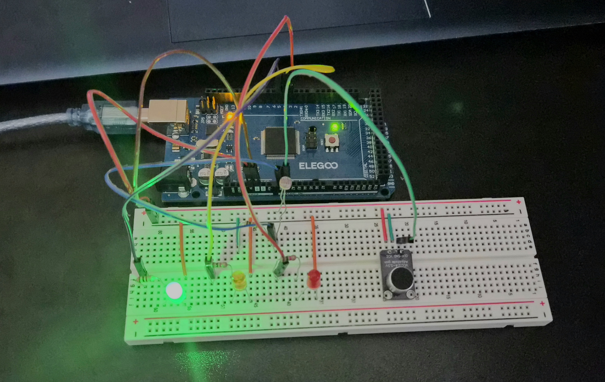
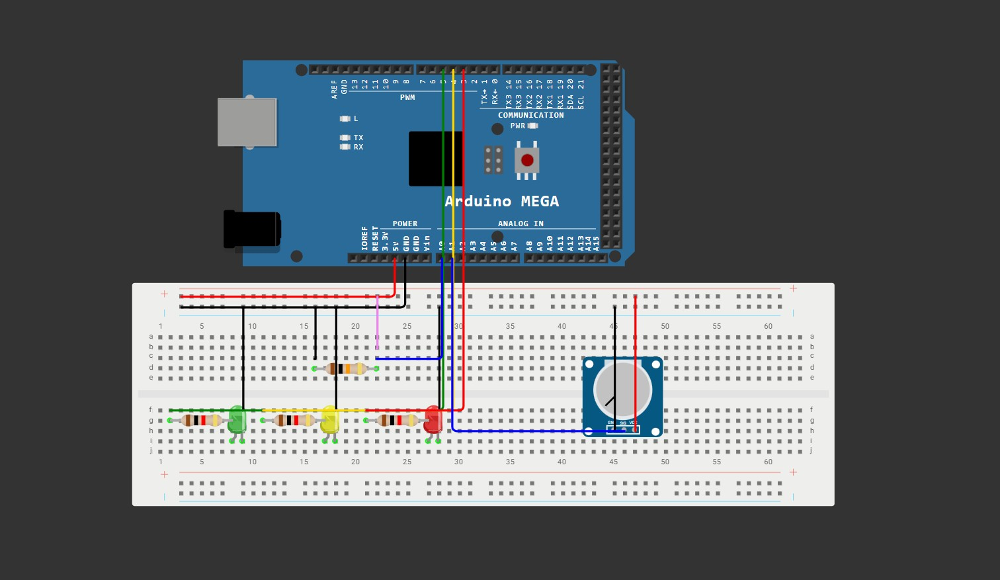

# Arduino-Environment-Monitor
Arduino-based environment monitor developed with C++ and Python to track real-time sound level and light intensity. Environmental state is conveyed through serial output, LED indicators, and live graphs.
Targeted topics/skills: embedded systems, sensor integration, serial communication, data visualization/graphing

## Project Photos

*Created using Wokwi. The exact components I used were not available so the pink wire represents the LDR and the potentiometer represents the microphone.*

## Hardware Materials
- 1 ELEGOO MEGA R3 Board ATmega 2560
- 1 Breadboard
- 1 Photoresistor (LDR)
- 1 Electret microphone (GY-MAX4466)
- 3 1kΩ Resistors
- 1 10kΩ Resistors
- 1 Green LED
- 1 Yellow LED
- 1 Red LED
- Assortment of jumper wires

## Software Materials
- C++
- Python
- PySerial
- Matplotlib
- Arduino IDE
- VS Code

## Functionality
- Photoresistor and microphone sense how bright and loud the environment is
- LEDs indicate how "intense" the environment is based on sensor input in comparison to baseline values
- Serial output includes sensor reading values, LED status (green, yellow, or red), and a written description of sound and light levels
- Two live-updating line graphs visually represent sound and light levels

## Implementation
The photoresistor and microphone sense sound and light intensity and produce analog signals. The Arduino's ADC then converts these signals into numerical values that are averaged and stored as light and sound levels. These values are compared to baseline values to determine relative intensity, which is indicated by LEDs. Sound and light data is transmitted from the Arduino to a Python program in VS Code through serial communication where it is used to produce live graphs created with Matplotlib.

## Challenges and Successes
- Separation of code files (.ino, .cpp, .h) took longer than expected due to lack of C++ experience, though was manageable with research.
- Development of the project in C++ and Python was challenging due to lack of experience working with multiple languages on a single project, but became easier with research and the implementation of VS Code (as opposed to just Arduino IDE) 
- Potential improvements: add 3 more LEDs so that light and sound levels are indicated separately by different groups of LEDs, increase graph-update rate, add a temperature sensor